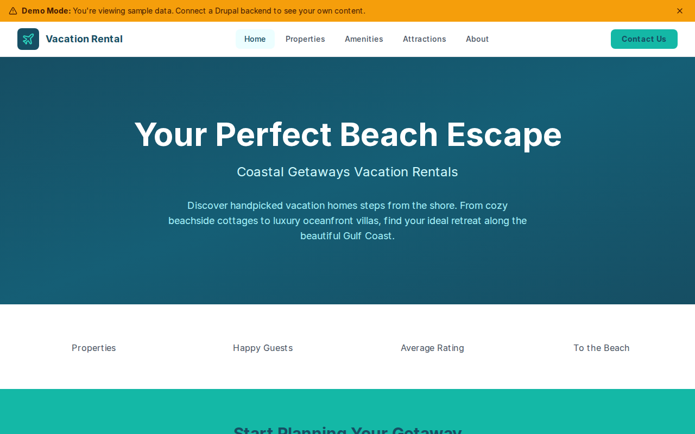

# Decoupled Vacation Rental

A vacation rental property website starter for Decoupled Drupal + Next.js. Built for beach house rental companies, vacation property managers, and holiday home agencies to showcase properties, amenities, and local attractions.



## Features

- **Properties** - Rental property listings with nightly rates, bedrooms, bathrooms, guest capacity, and amenity highlights
- **Amenities** - Included guest amenities like pool access, bike rentals, concierge services, and beach gear
- **Attractions** - Nearby attractions including beaches, dining, nature preserves, and outdoor activities
- **Modern Design** - Clean, inviting UI with teal and coastal color palette evoking ocean breezes

## Quick Start

### 1. Clone the template

```bash
npx degit nickstoneman/decoupled-vacation-rental my-vacation-rental
cd my-vacation-rental
npm install
```

### 2. Run interactive setup

```bash
npm run setup
```

This interactive script will:
- Authenticate with Decoupled.io (opens browser)
- Create a new Drupal space
- Wait for provisioning (~90 seconds)
- Configure your `.env.local` file
- Import sample content

### 3. Start development

```bash
npm run dev
```

Visit [http://localhost:3000](http://localhost:3000)

---

## Manual Setup

If you prefer to run each step manually:

<details>
<summary>Click to expand manual setup steps</summary>

### Authenticate with Decoupled.io

```bash
npx decoupled-cli@latest auth login
```

### Create a Drupal space

```bash
npx decoupled-cli@latest spaces create "My Vacation Rental"
```

Note the space ID returned (e.g., `Space ID: 1234`). Wait ~90 seconds for provisioning.

### Configure environment

```bash
npx decoupled-cli@latest spaces env 1234 --write .env.local
```

### Import content

```bash
npm run setup-content
```

This imports:
- Homepage with hero, statistics, and call-to-action sections
- 4 Properties (Oceanfront Villa, Beachside Bungalow, Sunset Cottage, Harbor View Condo)
- 3 Amenities (Private Pool Access, Complimentary Bike Rentals, Personal Concierge Service)
- 3 Attractions (Sunset Beach, Harbor Dining District, Coastal Nature Preserve)
- 2 Static Pages (About, Contact)

</details>

## Content Types

### Property
- Title, Body (description and features)
- Property Type (taxonomy: Beach House, Villa, Condo, Cottage, Bungalow)
- Nightly Rate, Bedrooms, Bathrooms, Max Guests
- Amenities (string list), Featured flag
- Property Image

### Amenity
- Title, Body (details and instructions)
- Amenity Category (taxonomy: Pool & Beach, Recreation, Concierge Services)
- Availability, Included flag
- Amenity Image

### Attraction
- Title, Body (description and highlights)
- Attraction Type (taxonomy: Beach, Restaurant, Outdoor Activity, Shopping)
- Distance from Properties, Address
- Attraction Image

## Customization

### Colors & Branding
Edit `tailwind.config.js` to customize colors, fonts, and spacing. The default palette uses teal/cyan coastal tones.

### Content Structure
Modify `data/vacation-rental-content.json` to add or change content types and sample content.

### Components
React components are in `app/components/`. Update them to match your rental company's brand.

## Demo Mode

Demo mode allows you to showcase the application without connecting to a Drupal backend. It displays mock content for the homepage, properties, amenities, and attractions.

### Enable Demo Mode

Set the environment variable:

```bash
NEXT_PUBLIC_DEMO_MODE=true
```

Or add to `.env.local`:
```
NEXT_PUBLIC_DEMO_MODE=true
```

### What Demo Mode Does

- Shows a "Demo Mode" banner at the top of the page
- Returns mock data for all GraphQL queries
- Displays sample properties, amenities, and attractions
- No Drupal backend required

### Removing Demo Mode

To convert to a production app with real data:

1. Delete `lib/demo-mode.ts`
2. Delete `data/mock/` directory
3. Delete `app/components/DemoModeBanner.tsx`
4. Remove `DemoModeBanner` from `app/layout.tsx`
5. Remove demo mode checks from `app/api/graphql/route.ts`

## Deployment

### Vercel (Recommended)
[](https://vercel.com/new/clone?repository-url=https://github.com/nickstoneman/decoupled-vacation-rental)

Set `NEXT_PUBLIC_DEMO_MODE=true` in Vercel environment variables for a demo deployment.

### Other Platforms
Works with any Node.js hosting platform that supports Next.js.

## Documentation

- [Decoupled.io Docs](https://www.decoupled.io/docs)
- [Next.js Documentation](https://nextjs.org/docs)
- [Drupal GraphQL](https://www.decoupled.io/docs/graphql)

## License

MIT
